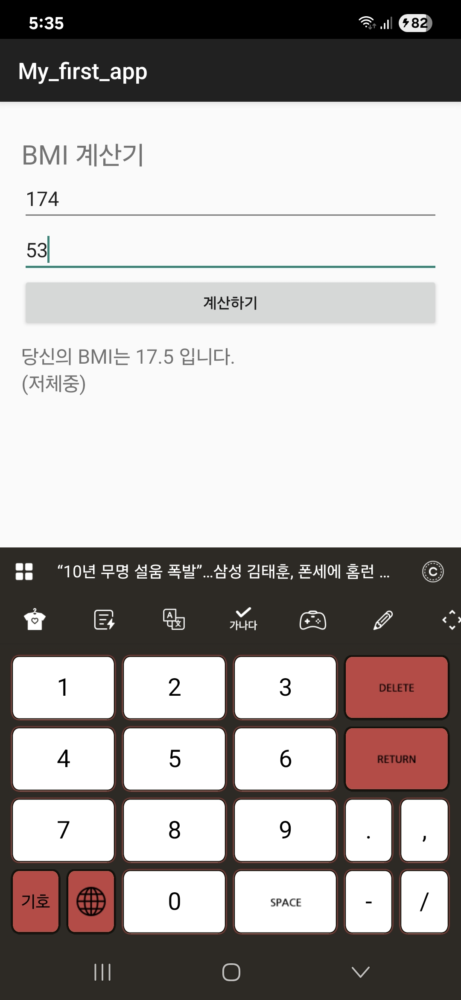

사용자의 키와 몸무게를 입력받아 BMI(체질량지수)를 계산하고, 저체중/정상/과체중/비만 여부를 알려주는 간단한 안드로이드 앱입니다.

1.키(cm)와 몸무게(kg) 입력
2. BMI 계산
3. 체중 상태 분류 (저체중/정상/과체중/비만)

- 저체중: 18.5 미만
- 정상: 18.5 ~ 25 미만
- 과체중: 25 ~ 30 미만
- 비만: 30 이상

W03 앱 화면

W04 앱 화면

W05앱 화면

W06앱 화면

Cupcake화면

